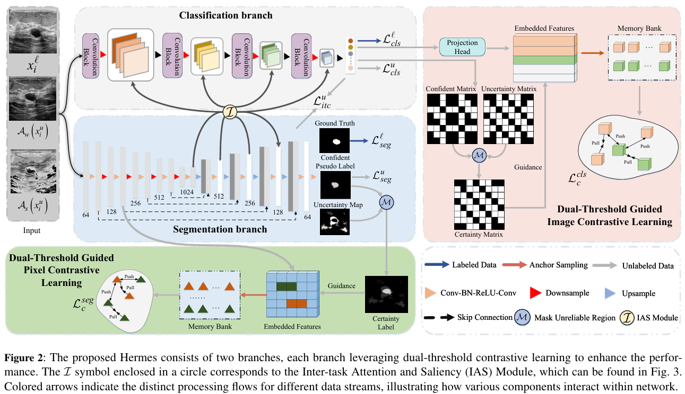
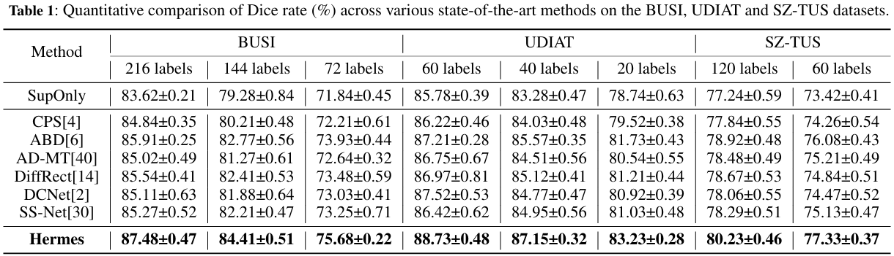
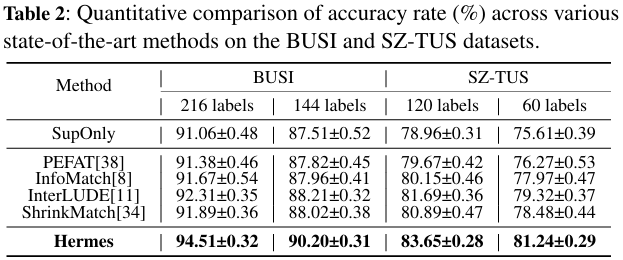
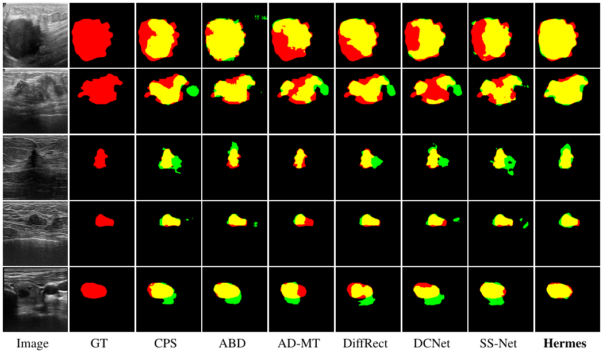

# Hermes
[ECAI 2025 oral] Official code for "[Semi-Supervised Dual-Threshold Contrastive Learning for Ultrasound Image Classification and Segmentation](https://arxiv.org/abs/2508.02265)".

### Authors:
- **Peng Zhang**, **Zhihui Lai**, **Heng Kong**

# Abstract
Confidence-based pseudo-label selection usually generates overly confident yet incorrect predictions, due to the early misleadingness of 
model and overfitting inaccurate pseudo-labels in the learning process, which heavily degrades the performance of semi-supervised contrastive 
learning. Moreover, segmentation and  classification tasks are treated independently and the affinity fails to be fully explored.
To address these issues, we propose a novel  semi-supervised dual-threshold contrastive learning strategy for ultrasound image 
classification and segmentation, named Hermes. This  strategy combines the strengths of contrastive learning with semi-supervised learning,
where the pseudo-labels assist contrastive learning by providing additional guidance. Specifically, an inter-task attention and saliency
module is also developed to facilitate information sharing between the segmentation and classification tasks. Furthermore, an inter-task consistency
learning strategy is designed to align tumor features across both tasks, avoiding negative transfer for reducing features discrepancy.
To solve the lack of publicly available ultrasound datasets, we have collected the SZ-TUS dataset, a thyroid ultrasound image dataset. Extensive experiments
on two public ultrasound datasets and one private dataset demonstrate that Hermes consistently outperforms several state-of-the-art  methods across various
semi-supervised settings.

# Archicture


# Result
- Segmentation results:
    
    

- Classification results:
    
    


# Visualization


# Installation
Please refer to [requirements.txt](requirements.txt). 

# Dataset
*SZ-TUS* dataset can be found in this [Link](https://drive.google.com/drive/folders/1P4CtqRi0QYZ2FD47B0wObzefFTV4QmaN?usp=drive_link).
The form of the data can be found [labeled.txt](labeled.txt) and [unlabeled.txt](unlabeled.txt).

For dataset partitioning, please refer to [data_split.py](Code/DataProcess/data_split.py).

# Usage
- Segmentation: please run [seg_train.py](Code/seg_train.py), where saliency map is activated.
- Classification: please run [cls_train.py](Code/cls_seg.py), where inter-task attention is activated.

# Reference
- [https://github.com/tfzhou/ContrastiveSeg](https://github.com/tfzhou/ContrastiveSeg)


# Citation
```bibtex
@misc{zhang2025HERMES,
      title={Semi-Supervised Dual-Threshold Contrastive Learning for Ultrasound Image Classification and Segmentation}, 
      author={Peng Zhang and Zhihui Lai and Heng Kong},
      year={2025},
      eprint={2508.02265},
      archivePrefix={arXiv},
      primaryClass={cs.CV},
      url={https://arxiv.org/abs/2508.02265}, 
}
```


